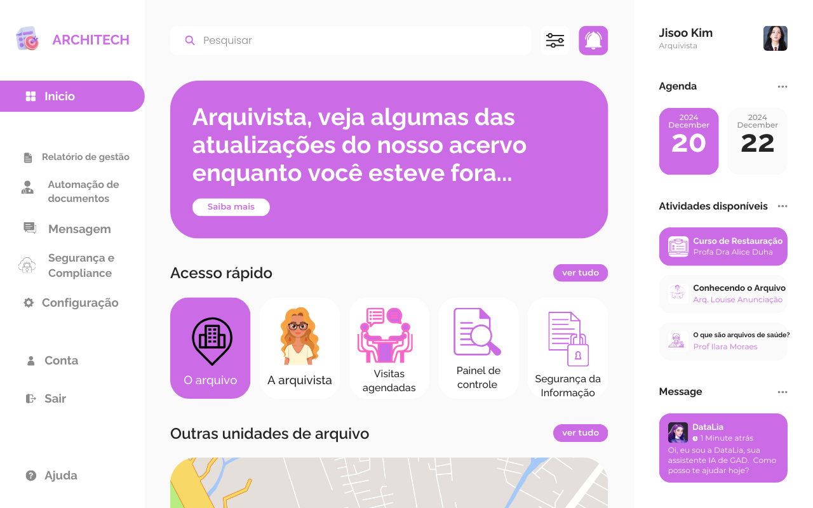

# 🏛️ Dashboard Architech - Gestão Arquivística Inteligente

O **Architech** é uma solução avançada de gestão documental que integra design moderno à Inteligência Artificial. Evoluído de um conceito visual, o sistema hoje é uma aplicação funcional capaz de centralizar acervos, automatizar a extração de metadados e oferecer uma interface de alta performance para a governança de dados.

---

### 🎯 Objetivo do Projeto

O objetivo deste Trabalho de Conclusão de Curso (TCC) é apresentar uma infraestrutura de front-end e back-end integrada para arquivamento digital. A aplicação visa otimizar o fluxo de trabalho arquivístico, facilitando a busca, o rastreamento físico-digital e a segurança da informação em conformidade com as melhores práticas de usabilidade.

---

### 🖼️ Preview do Sistema

O layout final utiliza uma arquitetura de três colunas, garantindo uma navegação fluida, conteúdo centralizado e um painel de monitoramento dinâmico.

### 🚀 Acesso e Execução

#### Domínio Oficial (Recomendado)
O projeto está em produção com certificado SSL ativo e pode ser acessado publicamente:

**[➡️ Acessar o Architech App](https://www.architechapp.com.br/)**

#### Execução Local
Para executar o ambiente de desenvolvimento, clone o repositório e utilize um servidor local (como Live Server) para garantir o funcionamento das integrações de API.

---

### ✨ Funcionalidades Implementadas

* **Análise Documental por IA (Gemini):** Upload assistido com extração automática de dados e classificação inteligente.
* **Hierarquia de Acesso (RBAC):** Níveis de permissão distintos para Arquivista Chefe, TI e Funcionários.
* **Dashboard em Tempo Real:** Painel lateral dinâmico que reflete o perfil do usuário e as últimas atualizações do banco de dados.
* **Responsividade Total:** Interface 100% adaptada para dispositivos Mobile (iOS/Android) e Desktop.
* **Protocolo QR Code:** Geração de identificadores exclusivos para vinculação entre o acervo físico e o registro digital.
* **Saudação Adaptativa:** Interface que reconhece o período do dia para interagir com o usuário de forma humanizada.

---

### 💻 Tecnologias Utilizadas

* **HTML5 & CSS3:** Estruturação semântica e estilização via Flexbox e CSS Grid.
* **JavaScript (ES6+):** Lógica de aplicação, manipulação de DOM e integração assíncrona.
* **Firebase (Google Cloud):** Autenticação (Auth), Banco de Dados (Realtime DB) e Hospedagem (Hosting).
* **Google Gemini API:** Motor de Inteligência Artificial para processamento e visão computacional.
* **Font Awesome & Google Fonts:** Identidade visual e bibliotecas de iconografia.

---

### 📂 Estrutura de Arquivos
/projeto-architech
|-- /html           # Páginas do ecossistema (Login, Configurações, Arquivos)
|-- /css            # Estilização modular e regras de responsividade
|-- /js             # Motores do sistema: Firebase, Gemini IA e Interações
|-- /img            # Ativos visuais e ícones do projeto
|-- index.html      # Página de entrada e autenticação
|-- README.md       # Documentação técnica e guia do projeto

    ---

### 👥 Equipe e Contribuições

Este projeto é o resultado da colaboração técnica e acadêmica dos seguintes integrantes:

* 🎨 **Design Visual & Prototipagem:** **Adriane Barreto**
     Responsável pela concepção visual original e design de interface (UI/UX).
* 💻 **Desenvolvimento Full-Stack:** **Vitor Lopes**
    * Responsável pela arquitetura de software, integração Firebase/IA e responsividade.
* 🤝 **Apoio no Desenvolvimento:** **Ana Luiza**
    * Colaboração em testes de usabilidade e refinamento de interface.

---

### ©️ Direitos Autorais e Licença

Projeto desenvolvido como Trabalho de Conclusão de Curso (TCC) no SENAI Camaçari.

**© 2026 - Todos os direitos reservados.**
A reprodução ou plágio deste conteúdo sem autorização prévia dos autores é estritamente proibida.

---