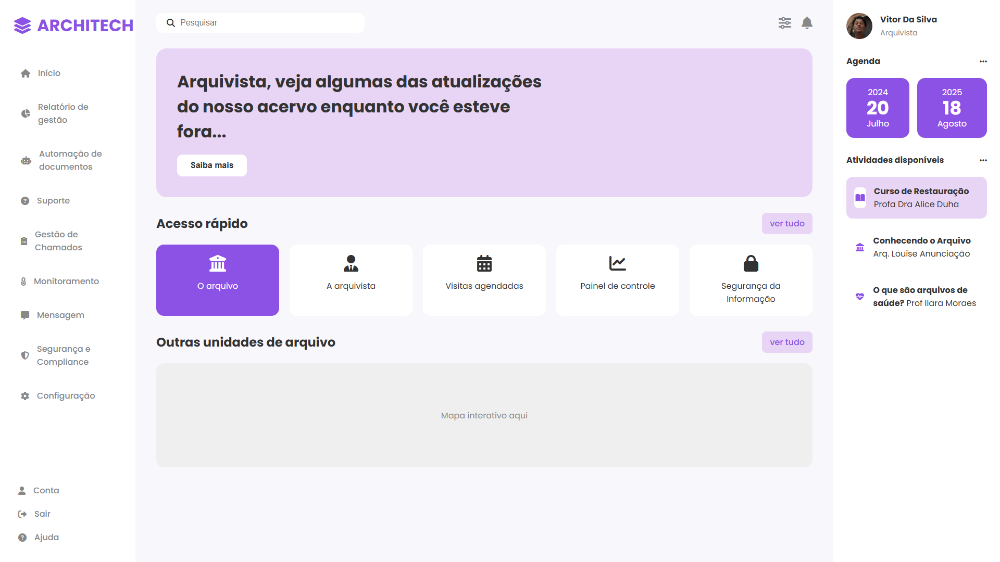

# 🏛️ Dashboard Architech - Gestão Arquivística Inteligente


O **Architech** é uma solução avançada de gestão documental que integra design moderno à Inteligência Artificial. Evoluído de um conceito visual para uma plataforma full-stack, o sistema hoje é capaz de centralizar acervos, automatizar a extração de metadados e oferecer uma interface de alta performance para a governança de dados em ambientes corporativos e públicos.

---

### 🎯 Objetivo do Projeto

Este projeto de Conclusão de Curso (TCC) apresenta uma infraestrutura integrada para arquivamento digital. A aplicação visa otimizar o fluxo de trabalho arquivístico tradicional, facilitando a busca, o rastreamento físico-digital (via QR Code) e garantindo a integridade da informação em conformidade com as melhores práticas de segurança e usabilidade (UI/UX).

---

### 🖼️ Preview do Sistema

A arquitetura de interface utiliza um padrão de três colunas (Dashboard Estendido), garantindo que as ferramentas de IA e os logs de atividade estejam sempre ao alcance do usuário.



---

### ✨ Funcionalidades Implementadas

#### 🤖 Inteligência Artificial Documental
* **Categorização por IA (Google Gemini):** Sistema de upload assistido que identifica automaticamente se um documento é administrativo, financeiro ou confidencial.
* **Extração de Metadados:** Processamento de linguagem natural (NLP) para leitura e preenchimento automático de campos, minimizando erros de digitação manual.

#### 🔐 Segurança e Governança
* **Recuperação de Senha Segura:** Fluxo de redefinição via e-mail com integração Firebase e proteção contra domínios não autorizados.
* **Controle de Acesso (RBAC):** Níveis hierárquicos (Arquivista Chefe, TI e Funcionários) que restringem o acesso a documentos sensíveis.

#### 📦 Gestão e Rastreabilidade
* **Protocolo QR Code:** Geração de códigos únicos para vinculação imediata entre pastas físicas e registros digitais.
* **Central de Ajuda Integrada:** Modais de FAQ e Suporte ao Cliente estilizados para assistência em tempo real.

#### 📱 Experiência do Usuário (UX/UI)
* **Responsividade:** Interface 100% adaptável para mobile e tablets via CSS Grid e Flexbox.
* **Saudação Adaptativa:** Lógica em tempo real que altera temas e mensagens conforme o horário (Manhã, Tarde ou Noite).

---

### 🛠️ Fluxo de Trabalho (Workflow)

1. **Autenticação:** O usuário acessa o sistema via Firebase Auth.
2. **Digitalização/Upload:** O documento é enviado ao sistema.
3. **Análise IA:** O Google Gemini processa a imagem/texto e sugere a categoria.
4. **Indexação:** O sistema gera um QR Code e armazena os metadados no Realtime Database.
5. **Consulta:** Busca rápida e filtragem por categorias automatizadas.

---

### 💻 Tecnologias Utilizadas

* **Frontend:** HTML5 semântico, CSS3 (Variáveis, Grid, Flexbox) e JavaScript Vanilla (ES6+).
* **Backend & Cloud:** Firebase (Authentication, Realtime Database e Hosting).
* **Inteligência Artificial:** Google Gemini API (Vision e Pro).
* **Infraestrutura:** Docker e Docker Compose para containerização.
* **Iconografia:** Font Awesome 6.0 e Google Fonts (Poppins/Inter).

---

### 📂 Estrutura de Arquivos

```text
/projeto-architech
├── .docker/          # Dockerfile e configurações de container
├── html/             # Páginas internas (Configurações, Arquivos, FAQ)
├── css/              # Estilização modular (Login, Dashboard, Modais)
├── js/               # Motores (Firebase, IA Gemini, UI logic)
├── img/              # Assets, logotipos e capturas de tela
├── index.html        # Portal de autenticação (Entry Point)
└── README.md         # Documentação técnica
```


### 🚀 Acesso e Execução

#### 🌐 Domínio Oficial (Recomendado)
O projeto está em produção com certificado SSL ativo:
* [➡️ **Acessar o Architech App**](https://www.architechapp.com.br/)

#### 🐳 Execução Local (Docker)
1. Certifique-se de ter o **Docker** instalado.
2. Clone o repositório e navegue até a pasta.
3. No terminal, execute o comando:

```
docker-compose up -d --build
```
4. Acesse: http://localhost:8080 no seu navegador. 


---

👥 Equipe e Contribuições
🎨 Design Visual & Prototipagem: Adriane Barreto

Concepção visual original e arquitetura de UI/UX no Figma.

💻 Desenvolvimento Full-Stack: Vitor Lopes

Arquitetura de software, integração Firebase/IA, DevOps e responsividade.

🤝 Apoio no Desenvolvimento: Ana Luiza

Testes de usabilidade, QA (Quality Assurance) e refinamento de interface.


---

©️ Direitos Autorais e Licença
Projeto desenvolvido no SENAI Camaçari para fins acadêmicos.

© 2026 - Todos os direitos reservados. A reprodução ou plágio deste conteúdo sem autorização prévia dos autores é estritamente proibida e sujeita a penalidades acadêmicas conforme o regimento interno da instituição.