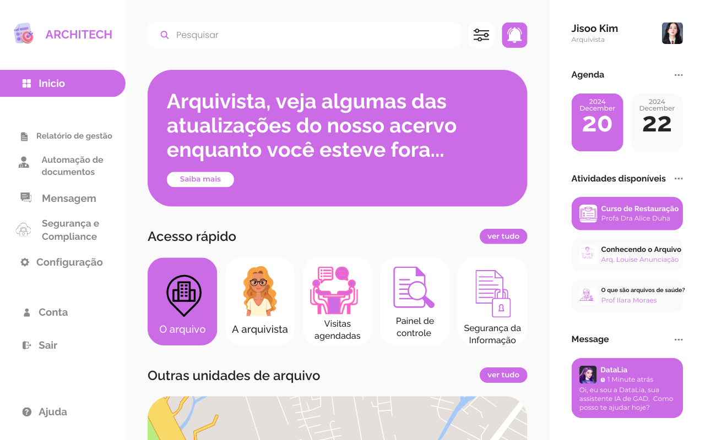

# Dashboard Architech - Protótipo TCC


Este projeto é a implementação em HTML, CSS e JavaScript de um dashboard para um sistema de gestão de arquivos chamado "Architech". A interface foi desenvolvida com base em um protótipo visual **criado na plataforma Canva**, focando em criar uma experiência de usuário limpa, moderna e intuitiva.

### 🎯 Objetivo do Projeto

O objetivo principal deste projeto de TCC (Trabalho de Conclusão de Curso) é desenvolver um protótipo de front-end funcional para um dashboard de arquivamento. A aplicação visa centralizar informações importantes, facilitar o acesso rápido a funcionalidades e oferecer uma interface clara para a gestão de documentos, seguindo as melhores práticas de design e usabilidade.

---

### 🖼️ Preview do Projeto

O layout final busca ser fiel à visão original do protótipo, com uma estrutura de três colunas que organiza as informações de forma clara e acessível.



### 🚀 Acesso e Execução

#### Acesso Online (Recomendado)

O projeto está hospedado na plataforma **Vercel** e pode ser acessado publicamente através do seguinte link:

**[➡️ Acessar o Dashboard Architech](https://site-archi-tech-projeto-tcc.vercel.app/)**

#### Execução Local

Para executar o projeto em sua máquina, basta clonar o repositório e abrir o arquivo `index.html` em seu navegador.

---

### ✨ Funcionalidades

* **Layout de 3 Colunas:** Estrutura principal dividida em navegação, conteúdo principal e painel de informações.
* **Design Limpo:** Uso de cores, ícones e espaçamentos consistentes para uma interface agradável.
* **Saudação Dinâmica:** O título principal exibe "Bom dia", "Boa tarde" ou "Boa noite" de acordo com o horário do usuário.
* **Navegação Interativa:** O item de menu clicado na barra lateral fica marcado como "ativo", dando feedback visual ao usuário.
* **Alertas de Interação:** Botões e ícones (como o sino de notificação) exibem alertas ao serem clicados, simulando futuras funcionalidades.

---

### 💻 Tecnologias Utilizadas

* **HTML5:** Para a estruturação semântica do conteúdo.
* **CSS3:** Para a estilização completa, utilizando Flexbox e CSS Grid para o layout.
* **JavaScript (ES6):** Para manipulação do DOM e interatividade do lado do cliente.
* **Google Fonts:** Para a tipografia do projeto (fonte "Poppins").
* **Font Awesome:** Para a biblioteca de ícones.

---

### 📂 Estrutura de Arquivos

```
/projeto-architech
|-- index.html      # Estrutura principal da página
|-- style.css       # Arquivo de estilos
|-- script.js       # Arquivo com as funcionalidades e interações
|-- interface.png   # Imagem de preview do protótipo
|-- README.md       # Documentação do projeto
```

---

### 👥 Equipe e Contribuições

Este projeto é o resultado da colaboração e do esforço de uma equipe dedicada. Agradecimentos especiais a todos os envolvidos:

* 🎨 **Protótipo e Design Visual:** **Adriane Barreto** - [LinkedIn](https://www.linkedin.com/in/seu-usuario/)
    * Idealizou e **criou no Canva** o protótipo que serviu como base e inspiração visual para toda a interface.

* 💻 **Desenvolvimento Principal (Front-End):** **Vitor Lopes** - [GitHub](https://github.com/seu-usuario) | [LinkedIn](https://www.linkedin.com/in/seu-usuario/)
    * Responsável pela codificação da maior parte da estrutura HTML, CSS e interações em JavaScript.

* 🤝 **Contribuição no Desenvolvimento:** **Ana Luiza** - [GitHub](https://github.com/seu-usuario) | [LinkedIn](https://www.linkedin.com/in/seu-usuario/)
    * Auxiliou em partes do código, colaborando com ajustes e contribuindo para a finalização do projeto.

---

### ©️ Direitos Autorais e Licença de Uso

Este é um projeto pessoal e acadêmico desenvolvido pelo grupo de TCC (Trabalho de Conclusão de Curso) do SENAI Camaçari.

**© 2025 - Todos os direitos reservados.**

A cópia, reprodução, distribuição ou plágio deste projeto, seja total ou parcial, é estritamente proibida sem a autorização prévia e por escrito dos autores. Para solicitações de permissão ou outras questões, por favor, entre em contato com os integrantes do grupo.
